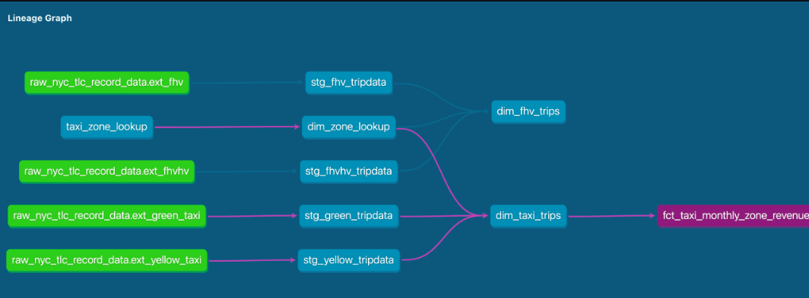

# NYC Taxi Data Analytics Engineering



## Project Overview

This project focuses on analytics engineering for the NYC taxi data pipeline using dbt (data build tool). It provides a structured approach to data transformation, testing, and documentation.

## Directory Structure

```
├── analyses/                           # Analysis queries and notebooks
├── dbt_project.yml                     # dbt project configuration
├── homework/                           # Homework assignments and solutions
├── macros/                            # Reusable SQL macros
├── models/                            # dbt models for data transformation
├── packages.yml                        # dbt package dependencies
├── seeds/                             # Seed data files
└── tests/                             # Data tests
```

## Setup Instructions

### Prerequisites
- Python 3.x
- dbt (data build tool)
- Required Python packages:
  ```sh
  pip install dbt-core
  ```

### Running the Project
1. Clone the repository:
   ```sh
   git clone <repo-url>
   cd <repo-folder>
   ```

2. Install dependencies:
   ```sh
   dbt deps
   ```

3. Run dbt models:
   ```sh
   dbt run
   ```

4. Run tests:
   ```sh
   dbt test
   ```

## Key Features

- Data transformation using dbt
- Automated data testing
- Data modeling and documentation
- Structured project organization
- Package management

## Resources
- [dbt Documentation](https://docs.getdbt.com/docs/introduction)
- [dbt Community](https://getdbt.com/community)
- [dbt Events](https://events.getdbt.com)
- [dbt Blog](https://blog.getdbt.com/)
